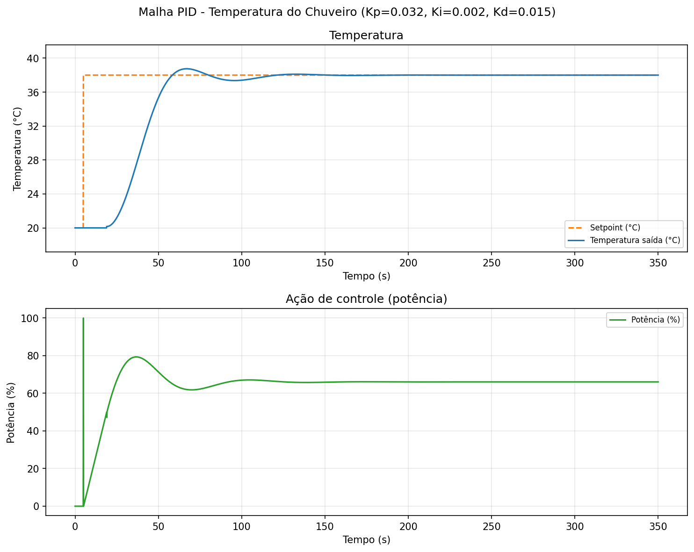
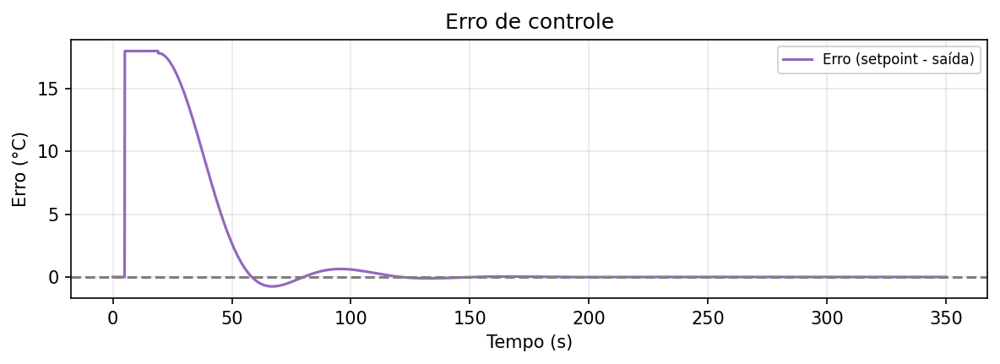

# Modelo computacional para ajuste de PID — Controle de temperatura em chuveiros elétricos

<p align="center">
  
</p>

Simulador da malha de controle PID com modelo parametrizado do equipamento, para **ajustar ganhos (Kp, Ki, Kd) em software antes da implementação no hardware**.

---

## Sobre o projeto

Este repositório contém um **modelo computacional** que replica o comportamento de um chuveiro elétrico com base em dados do fabricante e em medições empíricas. O objetivo é permitir o **ajuste da malha PID em ambiente de simulação**, reduzindo tentativa e erro no equipamento real.

A ideia do projeto é **avaliar a viabilidade de um trabalho futuro** em que um **microcontrolador (ESP32 ou ARM)** será usado para controlar o chuveiro em tempo real usando **software embarcado**. Esta etapa atual (modelo + simulação + tuning) corresponde à **primeira etapa**; a **segunda etapa** será a implementação no microcontrolador — firmware para leitura de setpoint e temperatura, execução do PID e comando do atuador (potenciômetro eletrônico 50 kΩ instalado junto à linha de potência do chuveiro).

- **Equipamento:** parâmetros como potência nominal, eficiência, volume do canal e faixa de vazão são configuráveis e refletem o chuveiro real.
- **Meio e condições de uso:** temperatura da água de entrada, temperatura ambiente, perda térmica e vazão podem ser alterados para simular diferentes cenários.
- **Vazão:** informada diretamente na simulação (em L/min).

---

## Funcionalidades

- Simulação em malha fechada: setpoint → PID → potência → modelo do chuveiro → temperatura de saída.
- Controlador PID com anti-windup; saída em potência normalizada (0–1), compatível com mapeamento para potenciômetro 50 kΩ e DAC/PWM no ESP32.
- Resposta ao degrau de setpoint e geração de gráficos (temperatura, potência, erro).
- Simulação em **regime permanente** com perturbações (setpoint, sensor ou entrada) e métricas de acomodação (ITAE local, pico de erro, oscilação).
- **PID com troca de ganhos** (partida → regime) sem salto na potência, via `ControladorPIDComAgendamento`.
- Modelo com **quantização de potência** (modo `degrau`) para aproximar potenciômetro digital.
- Ajuste por **grid search** (busca em grade) com critérios configuráveis (IAE, ITAE, ISE, overshoot, tempo de subida, etc.).
- **Tuning robusto:** varredura de temperaturas, vazão e ganhos PID em paralelo (`multiprocessing`), agregando o pior cenário (`agregar="max"`).
- Vazão informada diretamente na simulação (`vazao_lmin`).

---

## Requisitos

- **Python** 3.10 ou superior (recomendado 3.12.9+).
- Dependências (ver `requirements.txt`):
  - `numpy`, `matplotlib`, `scipy` — simulação e gráficos.
  - `scikit-learn` — tuning (grid search e critérios).
  - `tqdm` — barra de progresso no tuning robusto.

---

## Instalação

```bash
# Clonar o repositório (ou baixar e extrair)
git clone <url-do-repositorio>
cd Malha_PID_temperatura

# Criar e ativar ambiente virtual (recomendado)
python -m venv .venv
.venv\Scripts\activate        # Windows
# source .venv/bin/activate    # Linux/macOS

# Instalar dependências
pip install -r requirements.txt
```

---

## Uso

Fluxo sugerido: configurar parâmetros do chuveiro e do meio → **ajustar o PID na simulação** → usar os ganhos encontrados no equipamento real.

| Comando | Descrição |
|--------|------------|
| `python run_simulation.py` | Simulação com ganhos atuais; gráficos em `saida_simulacao/`. |
| `python run_simulacao_regime.py` | Regime permanente + perturbação pequena; gráficos e métricas em `saida_simulacao/`. |
| `python run_tuning.py` | Resposta ao degrau + grid search; resultados em `saida_tuning/`. |
| `python run_tuning_robusto.py` | Tuning robusto em vários cenários; ranking em `saida_tuning/tuning_robusto_resultado.txt`. |

Os parâmetros do chuveiro, do PID e da simulação são editados nos próprios scripts. Para o tuning robusto, os intervalos (início, fim, passo) de cada variável são definidos em `RangesTuningRobusto` em `run_tuning_robusto.py`.

As pastas `saida_simulacao/` e `saida_tuning/` são **geradas automaticamente** pelos scripts e não entram no repositório (ver `.gitignore`). Os exemplos visuais versionados ficam em `docs/`.

### Tuning robusto — como escolher os ganhos

Para resposta **rápida, estável e sem oscilações**, use o ranking da categoria **`estavel_sem_erro`** em `run_tuning_robusto.py`. Entre os melhores resultados, prefira o que tiver menor **`settling_time`**. Valide com `run_simulation.py` ou `run_simulacao_regime.py`.

Critério composto (menor é melhor):

| Componente | Peso | Objetivo |
|------------|------|----------|
| Erro em regime | 10 | Erro final próximo de zero |
| Oscilação em regime | 8 | Evitar hunting/ripple |
| Overshoot | 8 | Evitar ultrapassar o setpoint |
| Undershoot | 2 | Penalizar ficar abaixo do alvo |
| Banda de acomodação | ±1 % | Exige estabilização rigorosa |

A agregação **`max`** (pior caso) garante ganhos que funcionem em todas as combinações de vazão/temperatura definidas nos ranges.

### Simulação em regime permanente

```bash
python run_simulacao_regime.py
python run_simulacao_regime.py --tipo sensor
python run_simulacao_regime.py --t-troca-regime 200 --t-pert 350
python run_simulacao_regime.py --sem-troca-ganhos
```

Tipos de perturbação: `setpoint` (degrau pequeno), `sensor` (bias temporário na leitura) ou `entrada` (pulso na temperatura da água de entrada).

### Exemplo de saída da simulação

Ao rodar `python run_simulation.py`, são gerados gráficos como os abaixo: resposta da temperatura e da potência ao degrau de setpoint (ex.: 20 °C → 38 °C) e o erro de controle ao longo do tempo.

<p align="center">
  
</p>
<p align="center">
  <em>Resposta da malha PID — setpoint (tracejado), temperatura de saída e potência (%). Ex.: Kp=0,032, Ki=0,002, Kd=0,015.</em>
</p>

<p align="center">
  
</p>
<p align="center">
  <em>Erro de controle (setpoint − saída). O erro converge para zero após o degrau de setpoint.</em>
</p>

---

## Estrutura do projeto

| Caminho | Descrição |
|--------|------------|
| **`src/`** | Núcleo do modelo e da simulação. |
| `src/constantes.py` | Constantes físicas (calor específico e densidade da água). |
| `src/modelo_chuveiro.py` | `ParamsChuveiro`, `ModeloChuveiro` — modelo parametrizado do chuveiro. |
| `src/pid_controller.py` | `ParamsPID`, `ControladorPID`, `ControladorPIDComAgendamento` — PID com anti-windup e troca bumpless de ganhos. |
| `src/potenciometro.py` | `MapeamentoPotenciometro` — potenciômetro 50 kΩ e DAC/PWM (ESP32). |
| `src/simulation.py` | `ConfiguracaoSimulacao`, `AmbienteSimulacao` — simulação chuveiro + PID. |
| `src/graficos.py` | `Plotador`, `plotar_resposta`, `plotar_erro` — gráficos. |
| **`ambientes/`** | Ambientes de teste e sintonia. |
| `ambientes/ambiente_base.py` | `AmbienteBase` — base para ambientes de simulação. |
| `ambientes/resposta_degrau.py` | `AmbienteRespostaDegrau` — resposta ao degrau. |
| `ambientes/regime_permanente.py` | `AmbienteRegimePermanente` — perturbações em regime e métricas de acomodação. |
| `ambientes/sintonia_ml.py` | `AmbienteTuningML`, critérios (IAE, ITAE, overshoot, etc.), busca em grade. |
| `ambientes/sintonia_robusta.py` | `TuningRobusto`, `RangesTuningRobusto`, `RangeVar` — sintonia robusta. |
| **`docs/`** | Diagramas e imagens de referência (exemplos de saída, conceito do projeto). |
| **Raiz** | Scripts executáveis. |
| `run_simulation.py` | Simulação e gráficos. |
| `run_simulacao_regime.py` | Regime permanente, perturbações e troca de ganhos PID. |
| `run_tuning.py` | Resposta ao degrau + grid search. |
| `run_tuning_robusto.py` | Tuning robusto (multiprocessing). |
| `requirements.txt` | Dependências Python. |

---

## Parâmetros do modelo

O modelo distingue parâmetros de **equipamento**, de **meio** e de **uso**.

| Parâmetro | Descrição | Exemplo | Origem |
|-----------|-----------|---------|--------|
| `temperatura_inicial_agua` | Temperatura da água na entrada (°C) | 19 | Meio |
| `temperatura_desejada` | Setpoint (°C) | 38 | Uso |
| `temperatura_ambiente` | Temperatura do ambiente (°C) | 23 | Meio |
| `perda_meio` | Perda térmica para o meio (W/K) | 2 | Meio |
| `eficiencia_chuveiro` | Eficiência elétrica → térmica (0–1) | 0,95 | Equipamento |
| `potencia_minima` / `potencia_maxima` | Potência do resistor (W) | 0 / 6000 | Equipamento |
| `vazao_minima` / `vazao_maxima` | Faixa de vazão (L/min) | 2,5 / 10 | Equipamento / meio |
| `volume_canal` | Volume do canal aquecedor → saída (L) | 0,7 | Equipamento |
| `tensao_nominal_v` | Tensão nominal (V) | 220 | Equipamento |

O atraso de transporte (tempo até a saída) é calculado a partir da **vazão** e do **volume do canal**. A vazão na simulação é sempre definida por **`vazao_lmin`** em `ConfiguracaoSimulacao` (L/min).

---

## Modelo matemático (resumo)

- **Balanço de energia** no aquecedor: potência térmica útil, perdas para o meio, vazão e temperatura de entrada.
- **Dinâmica de primeira ordem** com integração numérica (Euler) e constante de tempo ligada ao volume e à vazão.
- **Atraso de transporte:** tempo = volume do canal / vazão (da saída do aquecedor até o ponto de medição).
- **Controle de potência:** contínuo (`linear`) ou quantizado em degraus (`degrau`), simulando potenciômetro digital.
- **Sensor:** temperatura na saída, com esse atraso.
- **PID:** atua na potência (0–100%) para manter a temperatura de saída no setpoint.

Isso permite testar diferentes condições de meio e ganhos do PID sem alterar o hardware.

---

## Microcontrolador (implementação real)

A saída do PID no modelo é potência normalizada (0–1). No **equipamento real**, essa saída é convertida em resistência do potenciômetro (0–50 kΩ) e em valor para DAC/PWM pela classe **`MapeamentoPotenciometro`** em `src/potenciometro.py`. Os ganhos ajustados na simulação podem ser usados diretamente no firmware embarcado (ESP32, ARM ou outro microcontrolador).

---

## Tecnologias

Python 3 · NumPy · Matplotlib · SciPy · scikit-learn · tqdm

---

## Próximos passos

- **Primeira etapa (atual):** inclusão de outras técnicas de ajuste no modelo (ex.: Ziegler-Nichols, otimização bayesiana).
- **Segunda etapa (software embarcado):** implementação em microcontrolador (ESP32 ou ARM) — firmware para leitura de setpoint e temperatura, execução do PID e comando do atuador, utilizando o mapeamento e os ganhos validados neste repositório.
